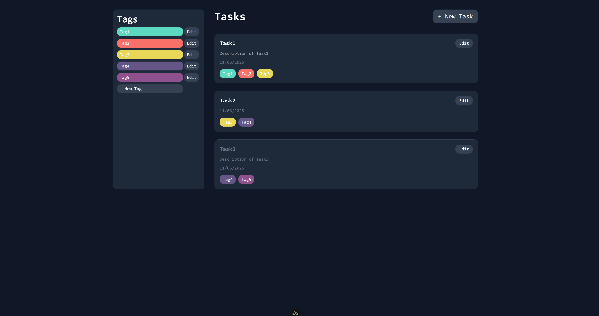

# SOLUTION DOCUMENTATION
<div align="center">
  
</div>
## Desciption & Workflow
The solution to the coding task is implemented within the api & client folders as well as within feature/api-setup & feature/client setup git branches. During frontend development additional branches (feature/api-fix#) were employed to perform small fixes and additions to the backend. PR to master followed by a rebase was used to get the client branch up to date with backend changes.

### Backend
All of the required endpoints were implemented in the api, basic validation, constraints and logging are also present.

Additionally implemented features:
- Task "Mark as done" flag & toggle endpoint
- Tag color variable & hash-based assignment function
- Space-separated multi-tag input from a string
- DTO's created for all models to perform cleaner comminication with frontend

### Frontend
Built a lightweight webpage using Tailwindcss for quick styling. Hit most endpoints, but put emphasis on simplicity. Mainly: replaced manual tag creation and editing with a string input & automatic color assignment based on hash value of tag name (computed on the backend) and not used get task by id and get tag by id endpoints in the frontend yet (Possible to implement later if needed). The frontend is separated into several components for better readibility of the main page and possibility for reuse.

Additionally implemented UI features:
- Toast notification component, reused for all errors
- TaskForm component, reused for both creating and editing a task
- DeleteConfirm component, reused for confirming deletion of both tasks and tags

## Deployment
1. Clone the repo
2. Install dependencies (NUXT & Tailwind)
3. Run the backend in /api:
```cmd
dotnet run
```
4. Run the frontend in /client:
```cmd
npm run dev
```

## HTTP ROUTES:
---

### **TasksController** (`[Route("api/tasks")]`)

| Method | Route                           | Description                            |
| ------ | ------------------------------- | -------------------------------------- |
| GET    | `/api/tasks`                    | Get all tasks                          |
| GET    | `/api/tasks/{id}`               | Get a specific task by ID (unused)     |
| POST   | `/api/tasks`                    | Create a new task                      |
| PUT    | `/api/tasks/{id}`               | Update an existing task                |
| DELETE | `/api/tasks/{id}`               | Delete a task                          |
| PATCH  | `/api/tasks/{id}/done`          | Toggle task Done/Undone                |
| POST   | `/api/tasks/{id}/tags-single`   | Assign a single tag to a task (unused) |
| POST   | `/api/tasks/{id}/tags-multiple` | Assign multiple tag to a task          |

---

### **TagsController** (`[Route("api/tags")]`)

| Method | Route                  | Description                         |
| ------ | ---------------------- | ----------------------------------- |
| GET    | `/api/tags`            | Get all tags                        |
| GET    | `/api/tags/{id}`       | Get a specific tag by ID (unused)   |
| GET    | `/api/tags/{id}/tasks` | Get all tasks associated with a tag |
| POST   | `/api/tags`            | Create a new tag (unused)           |
| PUT    | `/api/tags/{id}`       | Update an existig tag (unused)      |
| DELETE | `/api/tags/{id}`       | Delete a tag from db                |

---

## Validation Rules

### Task Model
| Field        | Validation                               |
|--------------|------------------------------------------|
| Id           | Set automatically by db                  |
| Name         | Required, Max length: 100                |
| Description  | Optional, Max length: 500                |
| Done         | Defaults to false                        |
| DateCreated  | Automatically set (formatted DD/MM/YYYY) |

### Tag Model
| Field        | Validation                               |
|--------------|------------------------------------------|
| Name         | Required, Max length: 50                 |
| Color        | Optional, Default: #cccccc             |
|              | Max length: 7, Min length: 4             |

### Other
- Controllers enforce `ModelState.IsValid` checks before save.
- API returns `400 Bad Request` with error details on validation failure.

## Logging & Exceptions

- All controllers use `ILogger<T>` for structured logging.
- Logs use message templates for structured key-value output.

| Level       | Description                                | Examples                                        |
|-------------|--------------------------------------------|-------------------------------------------------|
| Warning     | Resource not found or bad input            | Missing task/tag IDs, mismatched route/body IDs |
| Error       | Uncaught exception during DB operations    | Failed saves, update errors, delete errors      |

# (Task) Web Development Interview Test

## Introduction
Welcome to the web development interview test! This task is designed to assess your skills in both backend and frontend development. You will create a simple task application with an API and a client frontend. Follow the instructions carefully and make sure to demonstrate best practices in coding, structure, and git usage.

## Project Structure
You will find two folders in the repository:
- `api`
- `client`

You are required to implement the following within these folders.

## Task Description

### API Project
1. **Technology**: Use [ASP.NET](https://dotnet.microsoft.com/en-us/apps/aspnet/apis) in .NET 8 written in C#.
2. **Database**: Use SQLite for the database.
3. **ORM**: Use [Entity Framework](https://learn.microsoft.com/en-us/ef/core/) Core as the ORM.
4. **Functionality**:
    - Create a `Task` model representing a single task.
    - Additionally, create a `Tag` model to represent tags that can be associated with tasks.
    - Implement a many-to-many relationship between `Task` and `Tag` using a join table.
    - Create endpoints for basic CRUD operations:
        - `GET /api/tasks`: Retrieve all tasks.
        - `GET /api/tasks/{id}`: Retrieve a specific task by id.
        - `POST /api/tasks`: Create a new task.
        - `PUT /api/tasks/{id}`: Update an existing task.
        - `DELETE /api/tasks/{id}`: Delete a task.
        - `GET /api/tags`: Retrieve all tags.
        - `POST /api/tags`: Create a new tag.
        - `PUT /api/tags/{id}`: Update an existing tag.
        - `GET /api/tags/{id}/tasks`: Get all tasks for a tag.
        - `DELETE /api/tags/{id}`: Delete a tag.
        - `POST /api/tasks/{id}/tags`: Associate tags with a task.
    - Ensure proper validation, error handling, and logging.
5. **Best Practices**: Follow [RESTful principles](https://restfulapi.net/resource-naming/) for API design.

### Client Project
1. **Technology**: Use [Nuxt 3](https://nuxt.com/docs/getting-started/installation) for the frontend application.
2. **Functionality**:
    - Create a user interface to display the list of tasks.
    - Allow users to add, update, and delete tasks.
    - Allow users to add, update, and delete tags.
    - Allow users to assign tags to tasks.
    - Interact with the API to perform these operations.
3. **UI/UX**: Ensure the interface is user-friendly and visually appealing.

## Git Workflow
1. **Forking**: Fork this repository to your own GitHub account.
2. **Branching**: Use a feature-branch workflow. Create branches for different functionalities (e.g., `feature/api-setup`, `feature/client-setup`).
3. **Commits**: Make frequent, clear, and descriptive commits.
4. **Pull Requests**: Once you've completed a feature, create a pull request to merge it into your main branch. Include descriptive messages with your pull requests.
5. **Git Ignore**: Make sure only the necessary files are saved to the repository. Make proper use of gitignore.

## Additional Requirements
- **Documentation**: Add comments to your code where necessary and provide a brief documentation on how to set up and run the project.
- **Creativity**: Feel free to add any additional features or improvements that you think would make this project stand out.
- **BONUS: Testing**: Implement unit tests for the API or client using a framework of your choice.

## Submission
1. Ensure your project is well-documented.
2. Share the link to your forked repository with us.
3. Be prepared to discuss your code, decisions, and any challenges you faced during the development in a follow-up interview.

## Evaluation Criteria
- Adherence to best practices and coding standards.
- Clean and maintainable code.
- Proper use of git and version control best practices.
- User experience and design of the frontend application.
- Creativity and any additional features implemented.
- Documentation and code comments.

## Getting Started
1. Clone your forked repository to your local machine.
2. Set up the database and run the migrations.
3. Implement the required functionalities in both the `api` and `client` projects.
4. Submit your work as described in the submission section.

We look forward to seeing your solution!
